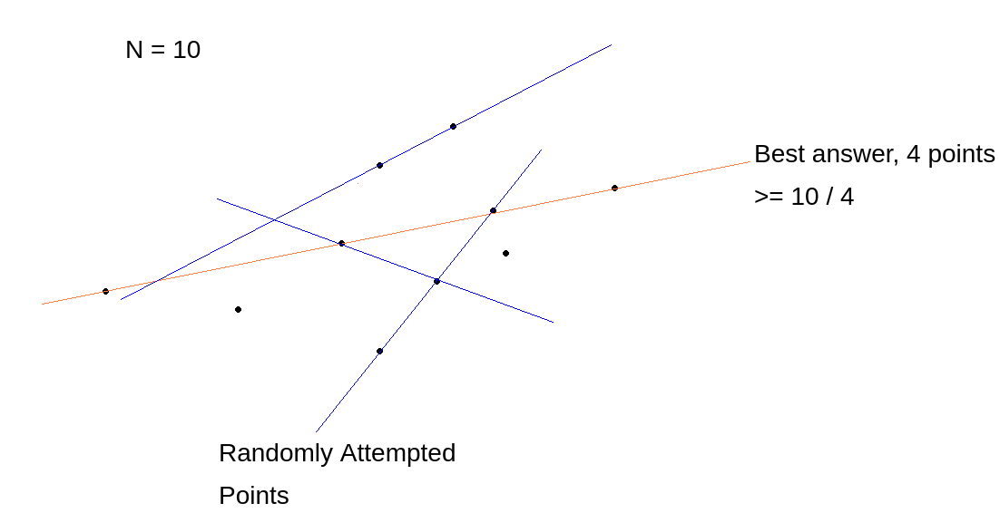

# Line through points

There are problems for which a fast algorithm may not exist, but under some specific constraints could allow for a much more efficient probabilistic algorithm. We'll cover an example of such a type of problem

### Problem

You are given a set of $N$ points on a 2-dimensional plane. Find a line that passes through the maximum number of points possible. It's guaranteed that the answer is at least $N/4$.

If we exclude the last constraint, that "the answer is guaranteed to be $\geq N / 4$", then the solution to this question is $O(n^2)$, which can be efficient, but infeasible for $N \geq 10^5$, for which we would require a solution with better time complexity.

We can make use of the fact that the answer is $\geq N/4$  to construct a probabilistic algorithm

### Probabilistic Algorithm

Say we pick two points from the set. What's the probability that both of these points are included in the answer?

$$P(\text{Both points are in answer}) = \frac{1}{4} \cdot \frac{1}{4} = \frac{1}{16}$$

Therefore, if we pick 2 points, the probability of the line connecting the two dots passes through the maximum number of points is $1/16$. Hence, the probability of it not being the answer is $15/16$.

Using this, we can pick 2 random points, and go through all the points in the set to check if they fall on this line (i.e co-linear with the 2 random points picked). After doing this multiple times, we can pick the maximum answer we've gotten with a good amount of confidence.

Say that we picked 2 random points $x$ times. The probability of not getting the answer will be 

$$P(\text{not getting best answer}) = \Big(\frac{15}{16}\Big)^{x}$$

This may not seem very reliable, because if we pick a value $x = 10$, the probability of not getting the best answer is $\approx 0.52$, which is pretty terrible. However, we need to remember that running a simulation takes $O(n)$ time, compared to the deterministic $O(n^2)$ solution, hence we can pick a larger $x$, such as $100$, which gives probability of failure as $\approx 0.00157$.

Therefore, with a sufficient value of $x$, we can get the right answer with a very high probability.

### Need for N/4 constraint

Say that we weren't given the $\geq N/4$ constraint. Would this algorithm still work?

Take an example where $N = 10^5$, and the answer is $100$.

The probability that both the points chosen randomly lie on the answer is 

$$P(\text{Both points are in answer}) = \frac{100}{100000} \cdot \frac{100}{100000} = \frac{1}{10^6}$$

Hence the probability of not getting the best answer is 

$$P(\text{not getting best answer}) = \Big(\frac{99999}{10^6}\Big)^x$$

Even if we pick $x = 100$, the probability of not getting the best answer is $\approx 0.999$

Only if we pick a value like $5\cdot 10^5$, we get the probability of failure down to $\approx 0.006$, but at that point, we're basically running an $O(n^2)$ solution.

Hence, we can see the significance of the $\geq N/4$ constraint, and how it allows us to pick random points with much higher probability of them being in the final answer that we're looking for.
