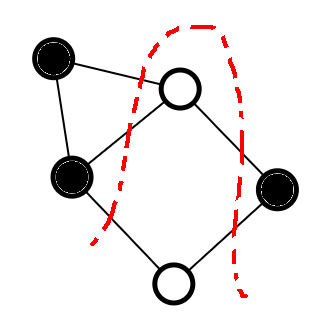

# Maximum Cut Problem

In the Maximum Cut problem, we are given an undirected graph $G(V,E)$. The motive of the maximum cut problem is to find a way to partition the nodes in the graph $G$ such that the number of edges that cross this partition is maximum.

Partitioning the given graph into two sets with max cut

Unfortunately, the Maximum Cut problem is NP-Complete, hence it's computationally intractable to find the exact answer in most cases.

However, there are special cases of graphs for which this problem may be must easier to compute.

### Bipartite Graphs

One of the clearest examples of types of graphs for which the maximum cut problem is much simpler computationally is the class of bipartite graphs. The definition of bipartite graphs is that we can create 2 independent sets of nodes, $U$ and $V$ such that every edge in the graph connects a node in $U$ to $V$. Hence, if we are given a bipartite graph $G(V,E)$, then the answer to the maximum cut problem is $\vert E \vert$.

Checking if a graph is bipartite can be done using a simple Depth First Search, in an attempt to color the nodes with 2 colors such that no 2 neighbors have the same color. The time complexity of this check is equal to the time complexity of the depth first search, which is $O(\vert V \vert + \vert E \vert)$.

### Example

Example of a bipartite graph

We are given a graph $G$ with $6$ vertices, and $8$ edges. By applying a bipartite check which takes linear time, we observe that the graph is bipartite. Hence, we can rearrange the graph to partition the nodes into 2 independent sets such that every edge crosses the partition.

A maximum cut on the given graph

Hence, the answer to this problem is 8 edges, which is the value of $\vert E \vert$ in his graph.

Hence, if the given graph is bipartite, the time complexity goes from NP-complete to a linear solution. A very significant improvement.

However, we must still find a way to provide a good answer to the maximum cut problem for graphs which don't have any special properties to reduce the time complexity.

One of the methods that can be used to solve the maximum cut problem using optimization is the Local Search algorithm.

### Using Local Search

Before we formally go over Local search, it'll be more fruitful if we go over an example of it in the maximum cut problem

We start off with an arbitrary partitioning of the nodes

Arbitrary initial cut for the given graph

We can clearly see that this partitioning isn't ideal, however it doesn't matter as we just have to start the algorithm with some initial configuration, after which we continue to improve upon that configuration.

Now, we'll define some notation in this algorithm

$$c_v(A,B)= \text{Number of edges incident on}\ v\ \text{that cross}\ (A,B)$$

$$d_v(A,B) = \text{Number of edges incident on}\ v\ \text{that don't cross}\ (A,B)$$

If the degree of the node $v$ is $x$, we can see that $c_v + d_v = x$.

The strategy we'll use, is that we'll go over every vertex, and compare their $c_i$ and $d_i$ values. 

If we see that for a certain vertex $v$, $d_v > c_v$, then we can improve upon the current answer.

Why is this true though? It's actually pretty easy to see why this works visually

Crossing edges marked blue, non-crossing edges marked green

We can see that for vertex $1$, $c_1 = 2$, $d_1 = 3$. In this configuration therefore, if we switch the partition to which the vertex $1$ belongs to, we'll get an improvement of $1$ more edge to the answer.

New configuration after switching partition of vertex 1

By switching the partition of vertex $1$, we've essentially switched the values of $c_1$ and $d_1$, as the edges which didn't cross the partition, cross them now, and vice versa.

However, we still haven't reached the end of the Local Search algorithm, as there are still vertices in the graph whose $d_v > c_v$.

Final configuration, which ends up being the optimal answer as well

We can move the vertices $5$ and $6$ to partition $A$ to end up with an answer $5$, which ends up being the best answer as well for the given graph. Note that however, the Local Search algorithm doesn't necessarily give the best answer.

### Running Time

We know that the algorithm will continue to run until it cannot find a single vertex for which $d_v > c_v$, after which it will terminate.

We know that in a graph with $V$ vertices, there can be at max $\binom{V}{2}$ edges, assuming no multi-edges and self-loops. hence, in the worst case, we'd start off with a cut that gives $0$ as the answer, and with every switch of vertices between partitions, we get an improvement of $1$  edge, hence taking $\binom{V}{2}$ switches in total.

Each switch takes $O(V)$  time, as we have to iterate through all the vertices to find a vertex that satisfies the inequality, as well as updating the $c_v, d_v$ values of all the nodes that connect to the node we're switching.

Hence, the time complexity turns out to be

$$O(V^2) \times O(V) = O(V^3)$$

Which is a major improvement over exponential running time, although it's not guaranteed to give the best answer.

### Why does it not work optimally?

It might seem enticing to claim that this local search algorithm can do pretty well, and it's hard to see where it might fail. However, getting sub-optimal answers from the algorithm is more common than you think. In fact, even if you run the local search algorithm on bipartite graphs, it still might not give the optimal maximum cut! We'll show how with an example

Say we're given a bipartite graph, and we choose an arbitrary cut. This arbitrary cut may end up giving us maximum cut, and we could just terminate. In the figure given, we can see that the arbitrary cut gives us $4$, which is the optimal answer for this graph.

Sometimes we may get lucky with our arbitrary cut

However, this may not be the case every time, and we may end up with a cut that prevents us from improving the answer any further with the local search algorithm

And sometimes, we might get unlucky

Here, we can see that the cut we have is clearly not the optimal. However, for every vertex in the graph $c_i = d_i$, hence we cannot switch any vertices to improve our answer. Hence, if we chose an arbitrary cut like this, we'd end up with the answer $2$, instead of the optimal answer $4$.

### Expected Value of an arbitrary cut

One may wonder what is the expected value that we get upon using a completely random cut. This is actually quite simple to analyze.

Instead of looking from the perspective of vertices, we'll analyze the expected value by looking at the edges.

Given an edge, there are 4 cases of where the 2 vertices at the endpoints of the edge might be.

1. Vertex $1$ and $2$ are both in partition $A$
2. Vertex $1$ is in partition $A$, while Vertex $2$ is in partition $B$
3. Vertex $1$ is in partition $B$, while Vertex $2$ is in partition $A$
4. Vertex $1$ and $2$ are both in partition $B$

We can see that cases $1$ and $4$ won't contribute to the final answer, while cases $2$ and $3$ will.

Each case has a $25\%$ chance of occurring, hence the expected value that this edge will contribute to the answer is 

$$E(\text{value contributed by edge e}) = \frac{1}{4}\cdot (0) + \frac{1}{4}\cdot (1) + \frac{1}{4}\cdot (1) + \frac{1}{4}\cdot (0) = 0.5$$

Using Linearity of Expectation, the total value contributed by all the edges will be 

$$\vert E \vert \cdot E(\text{value contributed by arbitrary edge e}) = \vert E \vert \cdot 0.5 = \frac{\vert E \vert}{2}$$

Hence, the expected value of an arbitrary cut is $\vert E \vert / 2$.

### Performance Guarantee

The Local search algorithm provides a lower bound for it's performance, and states that it'll output a cut in which the number of crossing edges is at least $50\%$  of the optimal answer of the given graph. (Which ends up being $\geq 50\%$   of $\vert E \vert$)

**Proof**

Say we have a locally optimum cut $(A,B)$, i.e. there are no more vertices to switch.

This implies that for every vertex $v$, $d_v(A,B) \leq c_v(A,B)$

Hence, if we sum up all the values, we get 

$$\sum_{v \in V} d_v(A,B) \leq\sum_{v \in V} c_v(A,B)$$

We are double counting every edge in this inequality, therefore, the inequality can be re-written as

$$2 \cdot \vert \text{non-crossing edges}\vert \leq 2 \cdot \vert \text{crossing edges}\vert$$

Adding  $2 \cdot \vert \text{crossing edges} \vert$ to both sides,

$$2 \cdot \vert E \vert \leq 4 \cdot \vert \text{crossing edges} \vert$$

Which gives us 

$$\vert \text{crossing edges} \vert \geq \frac{\vert E \vert}{2}$$

Hence, we can see that on average, the random cut will give an answer $\vert E\vert / 2$, while the local search algorithm will guarantee to give an answer $\geq \vert E \vert / 2$
