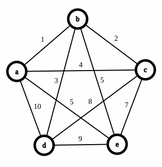

# Travelling Salesman Problem

We are going to deal with a somewhat specific version of the Travelling Salesman Problem.

**Problem**

We are given an input of a complete, undirected weighted graph $G(V,E)$, which means there exists an undirected edge with some weight $w_i$ between every pair of edges.

What we need to find is some tour $T$. A **tour** is a path which visits every vertex in the graph exactly once, and returns to the starting vertex. We need to minimize the sum of the weights of the edges taken in such a tour.

This problem is **NP-hard**. There exists a solution which takes $O(n\cdot 2^n)$ time, using dynamic programming, but this solution can be quite slow as soon as $n$ takes a relatively large value.

Therefore, we must make use of optimization algorithms to find a *good enough* solution which runs efficiently. We'll go over a method that uses local search to come up with a good answer.

We'll first make use of a heuristic to end up with a decent solution, upon which we'll apply the local search algorithm to make some improvements on top of that. 

The heuristic is quite simple, and it involves just greedily picking the closest neighbor to a vertex that we haven't visited

**Nearest neighbor Heuristic**

1. Pick an arbitrary vertex $x$
2. Mark the current vertex $v$ as visited ($\text{visited}[v] = \text{true})$
3. Find the set of all vertices that are connected to the current vertex, and are unvisited. Name this set $U$. If the set $U$  is empty, then go to step 8.
4. Find the vertex $u \in U$ such that $w(v, u)$ is minimal.
5. Add the weight to the total cost of the tour $\text{total cost} += w(v,u)$
6. Go to vertex $u$
7. Go to step 2
8. Go back to starting vertex $x$, by adding weight $w(v,u)$ to $\text{total cost}$.
9. Terminate program

Using this graph as an example for TSP

Say we need to run this heuristic on the given graph. Let's arbitrarily pick the starting vertex as $a$. 

Then, we tour over all the vertices in the graph as follows

1. Starting vertex $a$
2. Go to vertex $b$ $\text{(total cost = 1)}$
3. Go to vertex $c$ $\text{(total cost = 3)}$
4. Go to vertex $e$ $\text{(total cost = 10})$
5. Go to vertex $d$ $\text{(total cost = 19})$
6. Go to vertex $a$ $\text{(total cost = 29)}$

The tour after using the heuristic algorithm

Hence we end up with a total cost of $29$. We can observe that there is a tour that does end up with a lower cost, by going the route $a \Rightarrow c \Rightarrow b \Rightarrow d \Rightarrow e  \Rightarrow a$ , giving us a cost of $23$

An optimal solution

Hence, we can see why the heuristic doesn't give us the optimal answer, but it did end up giving us a pretty good solution.

However, a very glaring issue with the heuristic is the tunnel visioning it performs, looking at only the next step, which could cost dearly at the very end

Say instead of the cost of the edge between $a,d$ was $10000$ instead of $10$, and we still used the same greedy heuristic. We'd end up taking the, same path as before, and as a result of that, we'd end up with a cost of $10019$, instead of the optimal $23$.

The heuristic has glaring issues

Hence, we can clearly see that while the greedy heuristic can provide a pretty good solution in many cases, using the heuristic can lead to disastrous answers in other cases. Therefore, we must couple this heuristic with a method to improve upon a solution we reach to avoid very poor answers. Hence, using the tour we reach by using the heuristic, we apply local search to improve upon the solution.

**Local Search**

Before we try to use local search on the problem at hand, we must first define what is a neighbor. 

Obviously, we want a neighbor of a tour, to be a tour that shares the maximum amount of edges.

If we are given a graph with $n$ vertices, then the maximum amount of edges that two distinct tours can share is $n - 2$.

Now you may be wondering, why not $n - 1$? If you select $n - 1$ edges of a tour, then the last edge that has to be chosen is uniquely determined, which is using the edge between start and end vertices. Hence, if we had two distinct tours with $n - 1$ common edges, the $n^{th}$ edge would be common as well. 

Therefore, if we want to switch to a neighbor tour, then we must switch 2 of the edges of the current tour and add edges so that we get a new tour.

**Switching to a neighbor using 2-change**

1. Say we have a tour $T$. We remove $2$ edges, $(u,v)$, $(w, x)$, such that the two edges do not share a common endpoint.
2. Insert two new edges $(u, w)$, $(v,x)$ or $(u,x)$, $(v,w)$ such that the solution we get is a connected tour.

The new cost of the tour will be 

$$\text{new cost} =\text{original cost} - c_{(u,v)} - c_{(w,x)} + c_{a} + c_{b}$$

Where $a,b$ is $(u,w)$, $(v,x)$ or $(u,x)$, $(v,w)$ based on which pair gives a connected tour

Therefore, we can define the decrease in cost as 

$$(c_{(u,v)} + c_{(w,x)}) - (c_a + c_b)$$

Therefore, the algorithm we use to solve TSP using local search is:

- Given the graph, we pick an arbitrary starting node and use the nearest neighbor heuristic
- After the completion of the heuristic, we start applying local search by switching two edges whenever it'll give us a decrease in cost, and continue to do this step until we don't have any more neighbors which have a better cost.
- Return the tour $T$ we come up with

**Example**

Making use of the earlier $5$ node complete graph example, we'll show how local search will improve upon the solution we arrive at using the heuristic.

1. Apply the heuristic to get an initial configuration with cost $29$.
2. We see that deleting edges $(a,b)$ and $(d,e)$ to switch them with $(a,e)$ and $(b,d)$ reduces the cost to $27$.
3. We delete $(b,c)$ and $(a,d)$, to switch them with $(d,c)$ and $(a,b)$, reducing the cost to $24$.
4. There are no more 2-change neighbors which provide a decrease in cost, hence we terminate with cost $24$ as the answer.

Tour after heuristic

After one iteration of local search

After the second iteration of local search

**Running Time**

The number of ways we can choose a 2-change is $O(n^2)$, hence each iteration of the local search algorithm will take $O(n^2)$  time.

The number of iterations that local search does before halting can be exponential, however it's guaranteed to halt, as with each iteration, the cost of the tour has to be strictly lesser than the previous tour, else the local search wouldn't have made the change.

However, local search very rarely ends up taking exponential number of iterations, and even if it does, the local search algorithm for TSP has the convenient property of being an "anytime algorithm".

**What's an anytime algorithm**

An anytime algorithm is an algorithm which is allowed to terminate at any time. In local search, what we are attempting to do is improve upon a solution that we already have. Therefore, we could just terminate the local search after a fixed number of iterations, or a fixed amount of time in case you need the algorithm to terminate within a certain deadline.

**Bound on solution quality**

Unfortunately, there are no hard bounds on the quality of the solution you receive using this algorithm. However, it's been observed in practice that the solution is usually within $20\%$ of the actual solution, and based on the application can get better or worse in terms of quality.
